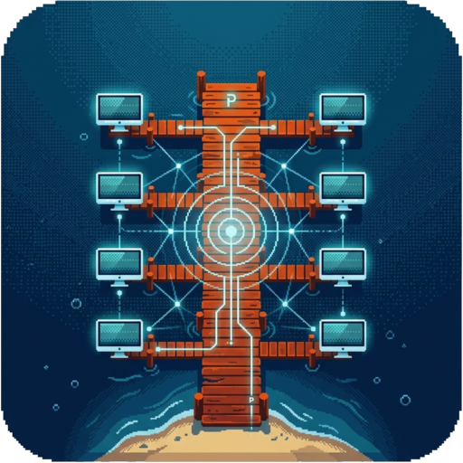

# Peeroxide: Compartilhamento de Tela P2P Sem Servidor

  

Toda noite, o mesmo canal de voz no Discord. Alguém abre o jogo e compartilha a tela, alguém transmite o episódio novo pra rapaziada, alguém jura que o vídeo do YouTube "tem só três minutos". Para a galera, o Discord não era um aplicativo: era a sala de estar. Em 17 de agosto de 2026, por ordem da ANPD (Autoridade Nacional de Proteção de Dados), o Discord suspendeu no Brasil o Go Live e as chamadas de vídeo ([Central de Ajuda do Discord](https://support.discord.com/hc/pt-br/articles/42704051358359-Por-que-os-recursos-de-v%C3%ADdeo-est%C3%A3o-indispon%C3%ADveis-no-Brasil-no-momento)).

O que veio depois foi uma sequência de gambiarras, cada uma pior que a anterior: VPN (Virtual Private Network) grátis de dono desconhecido, proxy do Windows apontando para um IP no Equador, site de watch party coberto de anúncios. Em algum momento a pergunta ficou inevitável: não existe um jeito descentralizado, sem servidor, peer-to-peer (tipo torrent) e *seguro* de fazer isso? Não achei. Então escrevi um: o **Peeroxide**, um app em Rust para fazer streaming da tela ou de um app. Em uma semana, ele foi do primeiro commit (22/09/2026) à versão 0.6.1 (28/09/2026), com vídeo em H.265 codificado na placa de vídeo, áudio em Opus, descoberta automática na rede local e criptografia de ponta a ponta sobre QUIC (o protocolo de transporte sobre UDP, User Datagram Protocol, padronizado na RFC 9000).

Este material conta essa história e, no caminho, abre o capô. Começamos pelo problema e pelas gambiarras, usando cada uma para aprender a fazer a pergunta que guia tudo: **em quem você está confiando quando compartilha sua tela?** Depois seguimos um quadro do vídeo de ponta a ponta, da captura na tela de quem transmite até a textura na GPU (Graphics Processing Unit) de quem assiste, passamos por cada recurso e por cada crate e biblioteca usada (inclusive as duas partes em C e C++: o decodificador libde265 e o OpenH264), e chegamos ao modelo de ameaças com STRIDE (Spoofing, Tampering, Repudiation, Information Disclosure, Denial of Service, Elevation of Privilege). Na sequência vêm as partes menos glamourosas e mais importantes: a atualização automática assinada, os testes (incluindo o smoke test de cada release) e o empacotamento. Por fim, levamos o Peeroxide para fora da rede local com o Headscale, uma implementação aberta e auto-hospedada do servidor de coordenação do Tailscale, sem que nenhum servidor carregue o vídeo.

Cada módulo abre com **"Onde a gente parou"** e fecha com **"Próximo Módulo"**, e um **placar de confiança** vai ganhando uma linha a cada solução testada. O objetivo é que, ao final, você consiga olhar para qualquer ferramenta de compartilhamento de tela, inclusive o próprio Peeroxide, e dizer exatamente quem pode ver, quem pode alterar e quem pode desligar.

> **Status do projeto:** o Peeroxide é **pre-alpha**. Funciona e é usado de verdade entre amigos, mas tem limitações conhecidas, e elas estão documentadas ao longo do texto, principalmente no Módulo 07. Código, requisitos, casos de abuso e roadmap: [github.com/gventino/peeroxide](https://github.com/gventino/peeroxide).

---

## Referências

### Protocolos e padrões
1. Iyengar, J. & Thomson, M. (2021). *RFC 9000: QUIC: A UDP-Based Multiplexed and Secure Transport.* IETF (Internet Engineering Task Force).
2. Thomson, M. & Turner, S. (2021). *RFC 9001: Using TLS to Secure QUIC.* IETF.
3. Rescorla, E. (2018). *RFC 8446: The Transport Layer Security (TLS) Protocol Version 1.3.* IETF.
4. Cheshire, S. & Krochmal, M. (2013). *RFC 6762: Multicast DNS.* IETF.
5. Cheshire, S. & Krochmal, M. (2013). *RFC 6763: DNS-Based Service Discovery.* IETF.
6. Valin, J.-M., Vos, K. & Terriberry, T. (2012). *RFC 6716: Definition of the Opus Audio Codec.* IETF.
7. Weil, J., Kuarsingh, V., Donley, C., Liljenstolpe, C. & Azinger, M. (2012). *RFC 6598: IANA-Reserved IPv4 Prefix for Shared Address Space.* IETF.
8. ITU-T (2013). *Recommendation H.265: High Efficiency Video Coding.* International Telecommunication Union.
9. ITU-R (1998). *Recommendation BT.1359: Relative Timing of Sound and Vision for Broadcasting.* International Telecommunication Union.

### Papers
10. Cohen, B. (2003). *Incentives Build Robustness in BitTorrent.* Workshop on Economics of Peer-to-Peer Systems.
11. Maymounkov, P. & Mazières, D. (2002). *Kademlia: A Peer-to-peer Information System Based on the XOR Metric.* IPTPS '02.
12. Ford, B., Srisuresh, P. & Kegel, D. (2005). *Peer-to-Peer Communication Across Network Address Translators.* USENIX ATC '05.
13. Donenfeld, J. A. (2017). *WireGuard: Next Generation Kernel Network Tunnel.* NDSS '17.
14. Wendlandt, D., Andersen, D. G. & Perrig, A. (2008). *Perspectives: Improving SSH-style Host Authentication with Multi-Path Probing.* USENIX ATC '08.
15. Sullivan, G. J., Ohm, J.-R., Han, W.-J. & Wiegand, T. (2012). *Overview of the High Efficiency Video Coding (HEVC) Standard.* IEEE Transactions on Circuits and Systems for Video Technology, 22(12), 1649–1668.

### Livros-texto
16. Shostack, A. (2014). *Threat Modeling: Designing for Security.* Wiley.
17. Kurose, J. F. & Ross, K. W. (2021). *Computer Networking: A Top-Down Approach.* 8th ed. Pearson. Caps. 2 e 8.
18. Tanenbaum, A. S. & Van Steen, M. (2017). *Distributed Systems.* 3rd ed. Caps. 2 e 9.

### Na web
19. Anderson, D. (2020). *How NAT traversal works.* Blog do Tailscale.
20. Headscale. *Documentação oficial.* [headscale.net](https://headscale.net/stable/)
21. Denis, F. *Minisign.* [jedisct1.github.io/minisign](https://jedisct1.github.io/minisign/)
22. Peeroxide. *README, requisitos funcionais e não funcionais, casos de uso, casos de abuso (STRIDE), roadmap e guia de release.* [github.com/gventino/peeroxide](https://github.com/gventino/peeroxide)
23. Discord (2026). *Por que os recursos de vídeo estão indisponíveis no Brasil no momento.* [Central de Ajuda do Discord](https://support.discord.com/hc/pt-br/articles/42704051358359-Por-que-os-recursos-de-v%C3%ADdeo-est%C3%A3o-indispon%C3%ADveis-no-Brasil-no-momento)
