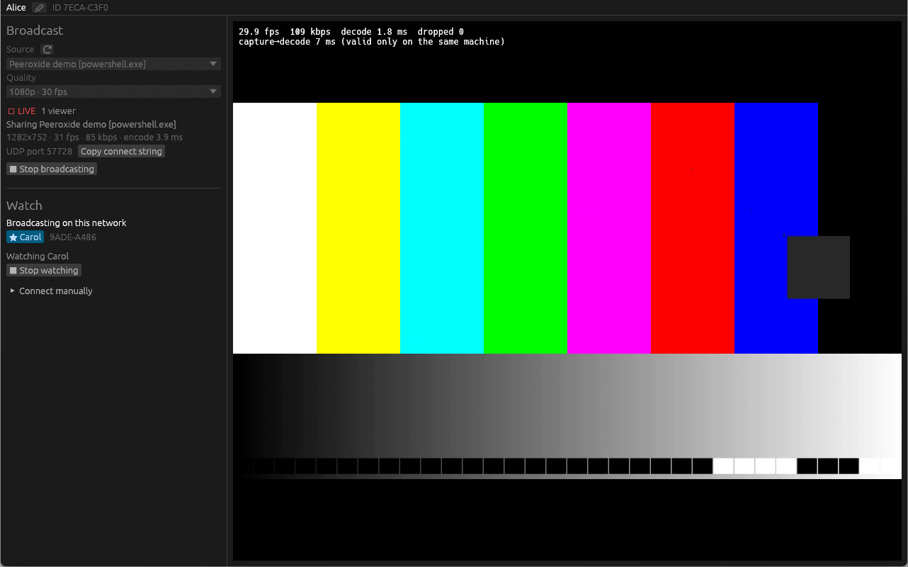
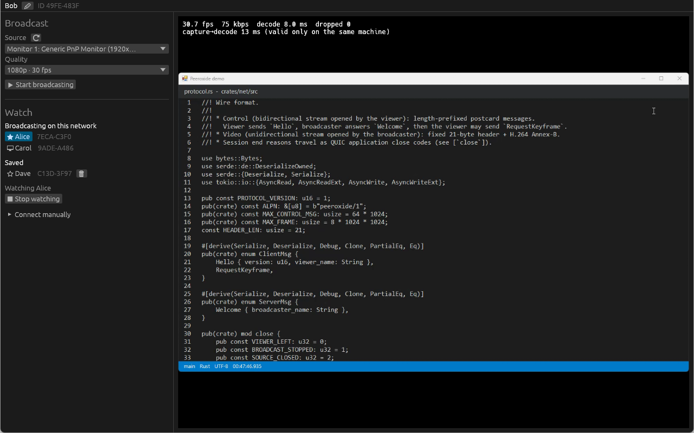

# Módulo 05: Por Dentro de Cada Feature

---

## Objetivo

Percorrer **cada recurso** do Peeroxide do jeito que a galera usa, e para cada um responder
duas perguntas: **o que a pessoa vê** e **como isso é construído por dentro**.

---

## Onde a gente parou

O quadro saiu da tela de Alice e chegou na de Bob. Só que ninguém na galera liga para
cabeçalho de 22 bytes. Liga para: "como eu compartilho só o jogo?", "por que o pessoal
está ouvindo o próprio eco?", "dá para deixar o filme num cantinho enquanto eu jogo?".

A interface tem duas metades: **Broadcast** (transmitir) à esquerda em cima,
**Watch** (assistir) embaixo, e o vídeo à direita.



*Transmitindo o padrão de teste em uma das primeiras versões: "LIVE, 1 viewer", a porta UDP
(User Datagram Protocol) fixa e o botão **Copy connect string**. No topo, o nome e o ID.*

---

## Transmitir: o que compartilhar

| Fonte           | Como é capturada                                                             |
|-----------------|------------------------------------------------------------------------------|
| Monitor         | A tela inteira, pela API de captura do sistema                               |
| Janela          | **Só aquela janela**, pela API de captura de janela do sistema              |
| Padrão de teste | Barras coloridas e um quadrado que pisca, gerados pelo próprio app           |

No Windows, a captura usa o WGC (Windows Graphics Capture); no macOS, o ScreenCaptureKit;
no Linux, o PipeWire pelo portal do sistema.

> **Janela é capturada como janela**, nunca recortando uma captura da tela inteira (AC-10).
> Se a janela for coberta por outra, quem assiste continua vendo a janela certa, não
> o que estiver por cima.

Comportamentos que valem conhecer:

- Redimensionar a janela compartilhada gera **tarjas** (o canvas é fixo), não troca de resolução.
- Minimizar a janela congela o último quadro (o Windows para de entregar quadros).
- Fechar a janela encerra a transmissão com "The shared window was closed".
- O padrão de teste existe para testar sem expor nada da sua tela. Com áudio ligado,
  ele apita a cada segundo, em sincronia com o quadrado que pisca.

---

## Transmitir: presets de qualidade

| Preset                         | Resolução | Quadros/s | Teto de vídeo | Áudio (Opus) |
|--------------------------------|-----------|-----------|---------------|--------------|
| 720p · 30 fps                  | 1280×720  | 30        | 4 Mbps        | 128 kbps     |
| 720p · 60 fps                  | 1280×720  | 60        | 6 Mbps        | 128 kbps     |
| 1080p · 30 fps                 | 1920×1080 | 30        | 8 Mbps        | 128 kbps     |
| 1080p · 60 fps                 | 1920×1080 | 60        | 12 Mbps       | 128 kbps     |
| **Internet / VPN** · 720p · 24 fps | 1280×720 | 24     | **2 Mbps**    | 64 kbps      |

Por que 24 fps no preset de internet? Porque **é a taxa de quadros de filmes, séries e anime**.
Para a watch party, não se perde nada; para o upload de casa, economiza muito.

Os presets são salvos por **identificador**, não por nome: renomear um preset numa versão
nova não apaga a escolha de ninguém.

---

## Transmitir: o codec

| Situação                                          | Codec usado                                   |
|---------------------------------------------------|-----------------------------------------------|
| Windows com placa NVIDIA, AMD ou Intel recente     | **H.265 codificado na GPU** (Graphics Processing Unit), via Media Foundation |
| Placa antiga, máquina virtual, macOS ou Linux     | H.264 na CPU (Central Processing Unit), via OpenH264 |
| O codificador da GPU falhou no meio da transmissão | Troca para H.264 na hora, sem reconectar     |

O H.265 (HEVC, High Efficiency Video Coding) na GPU usa pouca CPU, deixa 60 fps fácil e fica mais nítido que o H.264 na mesma taxa.
Configuração do codificador, pensada para ao vivo:

- **VBR (Variable Bitrate) de baixo atraso**, limitado ao teto do preset. CBR (Constant Bitrate)
  preenchia todo quadro até o teto sem ganho de qualidade.
- **Sem B-frames** (quadros que dependem de quadros futuros): cada quadro sai na hora.
- **Parâmetros do stream em todo keyframe**: qualquer um pode entrar em qualquer keyframe.

Medido com texto rolando no preset Internet: **H.265 a 1,2 Mbps** contra H.264 a 2,2 Mbps.

Quem assiste decodifica os dois, em qualquer plataforma. As estatísticas embaixo da
transmissão mostram qual está em uso.

---

## Transmitir: compartilhar áudio

A caixa **Share audio** vem **desligada** e diz exatamente o que vai ser capturado:

| Fonte   | O que quem assiste ouve                                                     |
|---------|-----------------------------------------------------------------------------|
| Janela  | **Só o som daquele app** (a árvore de processos dele)                       |
| Monitor | Todo o som do PC, **exceto o próprio Peeroxide** e os apps silenciados      |

- **O microfone nunca é capturado.** Para voz, a galera usa o canal de voz do Discord,
  que continua funcionando.
- O Peeroxide exclui o **próprio** som: quem transmite e assiste ao mesmo tempo nunca
  devolve o stream de outra pessoa para a rede.
- Ligar ou desligar o áudio vale para a transmissão inteira.

Por dentro: WASAPI (Windows Audio Session API) em modo *process loopback*, que captura o som
de uma árvore de processos (ou de tudo menos uma árvore). Exige Windows 10 2004 ou mais novo.

---

## Transmitir: silenciar apps

Aqui está o recurso que nasceu direto do uso real. A combinação da galera virou:
**voz no Discord + tela no Peeroxide**. Só que, compartilhando o monitor com áudio,
o som do Discord ia junto, e **todo mundo ouvia a própria voz de volta**, com atraso.

A solução é a lista **Mute apps**: os apps que estão tocando som, com caixinhas.

- Quem assiste **não ouve** os apps marcados; quem transmite continua ouvindo.
- Apps de voz já vêm marcados: Discord, TeamSpeak, Mumble, Skype, Teams, Zoom, WhatsApp,
  Telegram, Slack, Signal e outros.
- Funciona **ao vivo**; as mudanças valem em até um segundo, e as escolhas ficam salvas por app.

---

## Como o silenciar apps funciona

O loopback por processo do Windows só consegue **incluir ou excluir uma única árvore de
processos por captura**, e "tudo menos o Peeroxide" já gasta essa exclusão. Então:

```
Nada silenciado:          1 captura  = "tudo menos o Peeroxide"

Discord silenciado:       captura(jogo) ------┐
                          captura(navegador) -+--> mixer na linha --> Opus
                          captura(Steam) -----┘    do tempo (por
                                                   instante de captura)
                          (Discord e Peeroxide ficam de fora)
```

- Cada pedaço é posicionado pelo **instante de captura**; pequenas variações são alinhadas
  para cada stream continuar sem emenda.
- Os pedaços são somados e liberados em blocos de 10 ms, depois de 40 ms.
- A lista de apps é atualizada a cada segundo.
- Um processo que abriu um app silenciado (um launcher que abriu o Discord, por exemplo)
  também fica de fora, porque a captura dele incluiria o app silenciado.

---

## Assistir



*Assistindo em uma das primeiras versões: a lista "Broadcasting on this network", os contatos
salvos (★) e as estatísticas por cima do vídeo.*

- Quem está transmitindo aparece em **Broadcasting on this network**. Clique para assistir;
  clique em outro para trocar.
- **Uma transmissão por vez** (FR-06). Várias pessoas podem transmitir ao mesmo tempo
  (FR-08), e cada uma pode ter até 8 espectadores.
- Com áudio, aparecem **mute** e **volume**, que só afetam o que você ouve e ficam salvos.

---

## Tela cheia

- **F11**, duplo clique no vídeo ou o botão **⛶ Fullscreen**.
- Só o stream aparece. Mexendo o mouse, surge uma barra com nome, mute, volume e sair;
  ela some (com o cursor) depois de 2 segundos.
- **Esc**, F11 ou duplo clique voltam. A tela cheia termina sozinha quando o stream termina.

---

## Mini player

Minimizou o Peeroxide assistindo? O stream continua numa **janelinha sempre por cima**,
no canto inferior direito, como o picture-in-picture do Discord. Dá para arrastar,
redimensionar pelo canto superior esquerdo, e ela reabre onde foi deixada.

Por dentro, é o recurso com a história técnica mais curiosa:

- O `eframe` (a base da interface) redesenha uma janela minimizada no máximo a cada 100 ms
  e, enquanto ela está minimizada, **não roda a interface dela** nem abre janelas novas.
- Solução: o mini player é um **viewport adiado** (*deferred viewport*): uma janela própria,
  com seu próprio ciclo de redesenho na taxa do stream, que **já existe, escondida**, enquanto
  há um stream na tela. No instante em que a janela principal é minimizada, ela aparece.
- Ela compartilha a **mesma textura** de vídeo da janela principal, então alternar entre as
  duas nunca mostra um quadro preto, nem com a tela parada.

---

## Quem é quem: IDs e avisos

Cada peer tem um **ID** como `7268-E22A`, derivado do certificado (o começo do SHA-256, Secure
Hash Algorithm, dele), mostrado ao lado do nome.
A conexão é recusada se quem transmite não provar que é dono daquele ID (Módulo 07).

| Sinal         | Significado                                                                  |
|---------------|------------------------------------------------------------------------------|
| ⚠             | Dois peers transmitindo com o mesmo nome: pergunte o ID a quem você espera   |
| ⚠ vermelho    | Alguém usando o nome de um **contato salvo** com um ID **diferente**: reinstalação, ou tentativa de se passar por ele |
| ★             | Contato salvo                                                                |

Seu nome muda no ✏ ao lado dele (fora de transmissão).

---

## Contatos salvos e connect strings

**Saved:** todo mundo a quem você já assistiu fica lembrado (ID, nome, últimos endereços que
funcionaram). Se a descoberta não alcança a pessoa, ela aparece em **Saved**: um clique conecta
no último endereço; 🗑 esquece.

**Connect string:** quando o multicast não passa (Wi-Fi de visitante, algumas VPNs, a rede
do Tailscale), quem transmite clica em **Copy connect string**, escolhe o adaptador de rede
que compartilha com o amigo, e manda o texto:

```
100.64.0.7:57728#7ecac3f0...   (o fingerprint completo tem 64 dígitos hex)

100.64.0.7     IP no adaptador escolhido (aqui, um endereço do Tailscale)
57728          porta UDP fixa
7ecac3f0...    SHA-256 do certificado de quem transmite
```

O amigo cola em **Connect manually**. A partir daí, a pessoa fica salva, e como a porta é
fixa, a mesma string continua valendo depois de reiniciar.

> A connect string carrega o fingerprint: mesmo que alguém a intercepte e troque o IP,
> a conexão só completa com o dono daquele certificado.

---

## Estatísticas, logs e linha de comando

**Estatísticas** (por cima do vídeo): quadros por segundo, kbps, tempo de decodificação,
quadros descartados e "capture → decode" (válido só na mesma máquina, porque compara dois
relógios; é o BUG-06 do roadmap).

**Logs de sessão**, com rotação diária (`logs/session.log.AAAA-MM-DD`): transmissões,
espectadores (nome e endereço), sessões, motivos de encerramento e atualizações (AC-04).

**Opções de linha de comando:**

| Opção                          | Para quê                                                        |
|--------------------------------|-----------------------------------------------------------------|
| `--name <NOME>`                | Nome mostrado aos outros                                        |
| `--profile <NOME>`             | Identidade, configurações e logs separados (várias instâncias numa máquina) |
| `--broadcast <FONTE>`          | Já abre transmitindo: `test`, `monitor` ou parte do título de uma janela |
| `--share-audio`                | Com `--broadcast`, liga o áudio                                 |
| `--watch <NOME>`               | Assiste ao primeiro peer descoberto cujo nome contém `NOME`     |
| `--connect <IP:PORTA#FINGERPRINT>` | Conecta direto, sem descoberta                              |
| `--no-update`                  | Não procura atualização ao abrir                                |

Experimente numa máquina só:

```sh
peeroxide --profile a --name Alice --broadcast test --share-audio
peeroxide --profile b --name Bob --watch alice
```

---

## Onde ficam os dados

No Windows, `%APPDATA%\Peeroxide\data` (com `--profile x`, em `profiles\x`):

| Arquivo                                   | Conteúdo                                                   |
|-------------------------------------------|------------------------------------------------------------|
| `identity.cert.der`, `identity.key.der`   | A identidade. Apagar cria um ID novo                       |
| `settings.toml`                           | Nome, preset, porta, áudio, apps silenciados, volume, posição do mini player |
| `contacts.toml`                           | Contatos salvos: ID, nome, últimos endereços               |
| `logs/session.log.AAAA-MM-DD`             | Logs de sessão                                             |

Nada disso sai do seu computador. Não existe conta, nem nuvem, nem telemetria. A única
conexão para fora da sua rede é a checagem de atualização ao abrir (Módulo 08).

---

## Discussão

- Por que o microfone **nunca** é capturado, nem como opção? Que caso de abuso isso evita?
- Silenciar o Discord por padrão é uma decisão de privacidade ou de usabilidade? As duas?
- O mini player precisa existir escondido o tempo todo. Qual o custo disso, e por que
  vale a pena?
- Um contato salvo aparece com ⚠ vermelho. Quais são as explicações possíveis, e como
  você decide qual é a verdadeira?

---

## Resumo

| Recurso           | O que a pessoa vê                              | Por dentro                                        |
|-------------------|------------------------------------------------|---------------------------------------------------|
| Fontes            | Monitor, janela ou padrão de teste             | APIs de captura do sistema; canvas fixo           |
| Presets           | 720p/1080p, 30/60 fps, Internet a 24 fps       | Tetos de 2 a 12 Mbps; salvos por identificador    |
| Codec             | Nada: é automático                             | H.265 na GPU, H.264 como plano B, até no meio     |
| Share audio       | Caixa desligada que diz o que captura          | WASAPI process loopback; nunca o microfone        |
| Mute apps         | Lista de apps com voz já marcada               | Uma captura por app, misturadas por instante      |
| Tela cheia        | F11, barra que some                            | Regras testadas de entrada e saída                |
| Mini player       | Janelinha por cima ao minimizar                | Viewport adiado, escondido, mesma textura         |
| IDs e avisos      | `7268-E22A`, ⚠, ⚠ vermelho                     | SHA-256 do certificado; TOFU, Trust On First Use (Módulo 07) |
| Connect string    | Texto para colar                               | IP:porta#fingerprint; porta fixa                  |

---

## Próximo Módulo

Cada recurso aqui se apoia em alguém: uma crate, uma biblioteca em C, uma API do sistema.
No próximo módulo, a lista completa de quem faz o quê, e por que foram escolhidos.

---

## Referências deste módulo

- Peeroxide, README - seções "Using it", "Command-line options" e "Where data is kept"
- Peeroxide, `docs/functional-requirements.md` (FR-03, FR-06, FR-08, FR-14 a FR-21)
- Peeroxide, `docs/use-cases.md` (UC-10 tela cheia, UC-11 mini player)
- Sullivan et al. (2012) - estrutura de quadros e B-frames no HEVC
